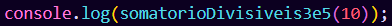

<h1 align="center">Somatório de Números Divisíveis por números inteiros</h1>

<h2 align="center">Descrição</h2>

Este é um projeto em javascript que calcula o somatório de todos os valores inteiros divisíveis por 3 ou 5 que são inferiores a um número fornecido. Ele é útil para encontrar a soma de números específicos dentro de um intervalo.

<h3>Como usar</h3>

<ol>
  <li>Clone o repositório   git clone https://github.com/Joao-Paulo-Moreira/somatorioDivisivel.git</li>
  <li>Abra o  arquivo   abra o arquivo `script.js` no seu editor de código</li>
  <li>Execute o script   Execute o script no Node.js</li>
  <li>Insira um número   Quando você executar o script, você vai precisar colocar um númerio inteiro positivo.</li>
  <li>Veja o resultado   O script calculará o somatório de todos os números divisíveis por 3 ou 5 que são inferiores ao número inserido e exibirá o resultado.</li>
  <li>Observe a mensagem de erro   Caso você coloque um valor invalido, o script vai te retornar uma mensagem de erro.</li>
</ol>

<h3>Exemplos</h3>
<h4>exemplo 1</h4>
Nessa primeira imagem temos o valor de 10, que irá retornar 23, que é o somatório dos números 3, 5, 6 e 9

<h4>Exemplo 2</h4>
Já nessa segunda imagem nós temos o valor de 11, que irá retornar 33, que é o somatório dos números 3, 5, 6, 9 e 10

<h3>Requisitos</h3>
<ul>
  <li>Para rodar esse projeto você vai precisar apenas do Node.js</li>
<\ul>
